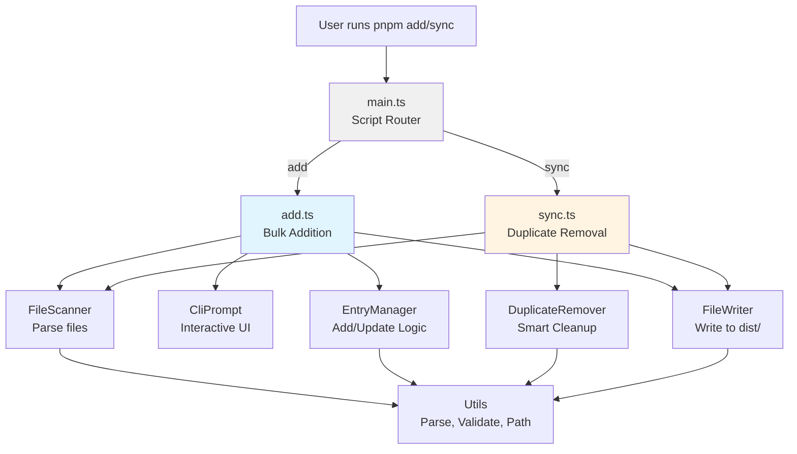
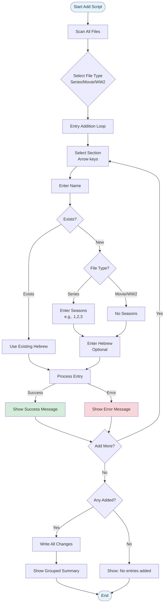
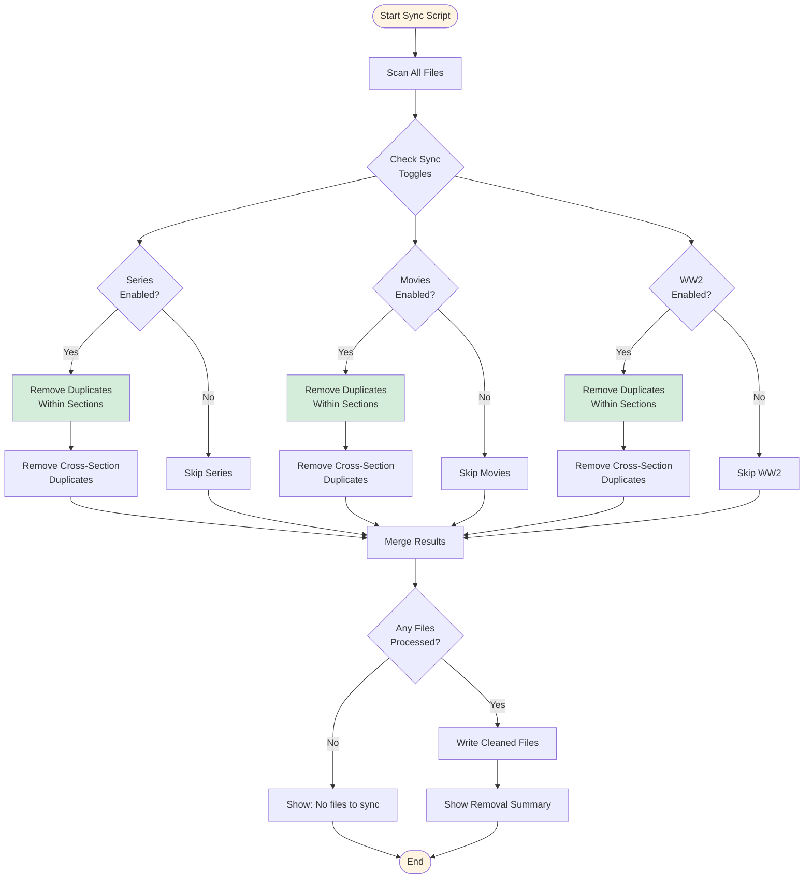
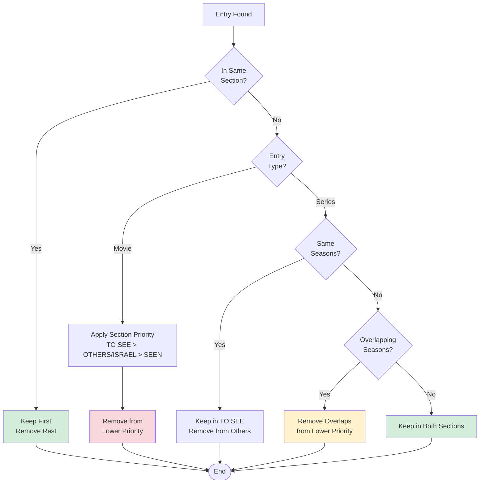

# Series and Movies Manager

A TypeScript CLI tool to manage series and movies watchlists across text files with interactive prompts, bulk additions, and smart duplicate removal.

Built in March 2026, this CLI utility streamlines watchlist management by organizing entries, preventing duplicates, supporting bulk updates, and providing an interactive interface for efficient tracking and maintenance of personal viewing lists across multiple files.

## Features

- 🎬 **Bulk Addition**: Add multiple entries in one session with interactive prompts
- 🔄 **Smart Sync**: Remove duplicates with intelligent section priority handling
- 🛡️ **Safe Operation**: All operations write to `dist/` folder, original files remain untouched
- 🎯 **Interactive CLI**: Arrow-key navigation for all selections
- 📺 **Season Management**: Merge and track series seasons across different sections
- 🌍 **Hebrew Support**: Optional Hebrew translations with RTL display formatting
- ✅ **Type Safety**: Fully typed with TypeScript
- 🧪 **Well Tested**: Comprehensive test coverage with 87 test cases

## Architecture Overview



## Prerequisites

- Node.js >= 18.0.0
- pnpm >= 8.0.0

## Installation

```bash
pnpm install
pnpm build
```

## Quick Start

### Add Entries

```bash
pnpm run add
```

Use arrow keys to navigate menus and add entries interactively. You can add multiple entries in one session!

### Clean Up Duplicates

```bash
pnpm run sync
```

Automatically removes duplicates and cleans up your collection files.

## Add Script Workflow



## Sync Script Workflow



## Duplicate Removal Logic



## Configuration

Edit `src/settings.ts`:

```typescript
export const settings: Settings = {
  seriesFilePath: '/Users/username/Downloads/to-see-series.txt',
  moviesFilePath: '/Users/username/Downloads/to-see-movies.txt',
  ww2FilePath: '/Users/username/Downloads/to-see-ww2.txt',
  outputDir: join(WORKSPACE_ROOT, 'dist'),
  syncSeries: true, // Enable/disable series file sync
  syncMovies: true, // Enable/disable movies file sync
  syncWW2: true, // Enable/disable WW2 file sync
};
```

## File Format

### Series File

```
TO SEE:
=======
Black Mirror: 7 (מראה שחורה)
Breaking Bad: 1, 2, 3 (שובר שורות)

SEEN:
=====
Dark: 1, 2, 3 (אפל)

OTHERS TO SEE:
==============
Westworld: 1, 2 (עולם המערב)
```

### Movies File

```
TO SEE:
=======
Inception 2010 (התחלה)
Interstellar 2014 (בין כוכבים)

SEEN:
=====
The Matrix 1999 (המטריקס)

ISRAEL:
=======
Waltz with Bashir 2008 (ואלס עם באשיר)
```

## Examples

### Adding Multiple Movies

```
===SCANNING FILES START===
===SCANNING FILES COMPLETE===
? What do you want to add? Movie
? Select section: Seen
? Name: Inception

Successfully added/updated "Inception" in seen section.

? Would you like to add more Movies? Yes
? Select section: To see
? Name: Interstellar
? Hebrew name (optional): בין כוכבים

Successfully added/updated "Interstellar" in to-see section.

? Would you like to add more Movies? No

==================================================
PREVIEW OF CHANGES
==================================================

SEEN (1 entries):
  - Inception 2010 (התחלה)

TO-SEE (1 entries):
  - Interstellar 2014 (בין כוכבים)

==================================================
? Write these changes to file? Yes

Successfully added/updated in seen section:
Inception 2010 (התחלה)

Successfully added/updated in to-see section:
Interstellar 2014 (בין כוכבים)

Output written to: /Users/username/Repos/series-and-movies/dist/to-see-movies.txt
```

### Syncing with Overlapping Seasons

**Before Sync:**

```
TO SEE:
Black Mirror: 1,2,3

SEEN:
Black Mirror: 3,4,5
```

**After Sync:**

```
TO SEE:
Black Mirror: 1,2,3

SEEN:
Black Mirror: 4,5
```

Season 3 is removed from SEEN because it's already in TO SEE (higher priority).

## Business Rules

### Name Matching

- Case-insensitive comparison
- Exact name matching (prevents false positives)
- For movies: Smart year matching (e.g., "Halloween" matches "Halloween 2018")
- For series: Names with appended numbers are treated as different series (e.g., "The Last of Us" ≠ "The Last of Us 1")

### Season Management

- Seasons are automatically merged and sorted
- Duplicate seasons are removed
- Format: comma-separated positive integers (1-1000)
- Season numbers extracted after the LAST colon in series names

### Duplicate Prevention

- Same name + same seasons in same section → Error
- Same name with different seasons in different sections → Allowed
- Movies (no seasons) cannot exist in multiple sections simultaneously

### Section Priority

1. **TO SEE**: Priority 3 (highest)
2. **OTHERS / ISRAEL**: Priority 2
3. **SEEN**: Priority 1 (lowest)

When conflicts arise, entries are kept in higher priority sections.

## Development

### Build

```bash
pnpm build
```

### Run Tests

```bash
pnpm test           # Run all tests
pnpm test:watch     # Watch mode
```

### Linting & Formatting

```bash
pnpm lint           # Check linting
pnpm lint:fix       # Fix linting issues
pnpm prettier       # Check formatting
pnpm prettier:fix   # Fix formatting
```

## Project Structure

```
series-and-movies/
├── src/
│   ├── main.ts                   # Entry point/router
│   ├── settings.ts               # Configuration
│   ├── scripts/
│   │   ├── index.ts              # Barrel export
│   │   ├── add.ts                # Bulk addition workflow
│   │   └── sync.ts               # Duplicate removal
│   ├── types/
│   │   └── index.ts              # Type definitions
│   ├── core/
│   │   ├── index.ts              # Barrel export
│   │   ├── fileScanner.ts        # File parsing
│   │   ├── cliPrompt.ts          # Interactive prompts (inquirer)
│   │   ├── entryManager.ts       # Add/update/move logic
│   │   ├── fileWriter.ts         # File writing
│   │   ├── duplicateRemover.ts   # Duplicate detection/removal
│   │   └── __tests__/            # Core tests
│   └── utils/
│       ├── index.ts              # Barrel export
│       ├── parseUtils.ts         # Parsing utilities
│       ├── validationUtils.ts    # Validation utilities
│       ├── pathUtils.ts          # Path/directory utilities
│       └── __tests__/            # Utils tests
├── dist/                         # Output directory (git-ignored)
├── CONTRIBUTING.md               # Contribution guidelines
├── INSTRUCTIONS.md               # Detailed user instructions
├── LICENSE                       # MIT License
└── README.md                     # This file
```

## Contributing

Contributions are welcome! Please read [CONTRIBUTING.md](CONTRIBUTING.md) for guidelines.

## Documentation

- **[CONTRIBUTING.md](CONTRIBUTING.md)** - Development guidelines, coding standards, testing
- **[INSTRUCTIONS.md](INSTRUCTIONS.md)** - Detailed usage instructions, workflows, troubleshooting

## Acknowledgments

- Built with [TypeScript](https://www.typescriptlang.org/)
- CLI powered by [Inquirer.js](https://github.com/SBoudrias/Inquirer.js)
- Testing with [Vitest](https://vitest.dev/)

## Support

- 📖 **Documentation**: Read [INSTRUCTIONS.md](INSTRUCTIONS.md) for detailed usage guide
- 🐛 **Bug Reports**: Open an issue on GitHub
- 💡 **Feature Requests**: Open an issue with the `enhancement` label
- ❓ **Questions**: Open an issue with the `question` label

## Roadmap

Future enhancements under consideration:

- Export to different formats (JSON, CSV, Markdown)
- Import from external sources (IMDb lists, etc.)
- Statistics and analytics (watch time, completion rates)
- Backup and restore functionality
- Multi-language support beyond Hebrew

## Author

- **Or Assayag** - _Initial work_ - [orassayag](https://github.com/orassayag)
- Or Assayag <orassayag@gmail.com>
- GitHub: https://github.com/orassayag
- StackOverflow: https://stackoverflow.com/users/4442606/or-assayag?tab=profile
- LinkedIn: https://linkedin.com/in/orassayag

## License

This application has an MIT license - see the [LICENSE](LICENSE) file for details.
